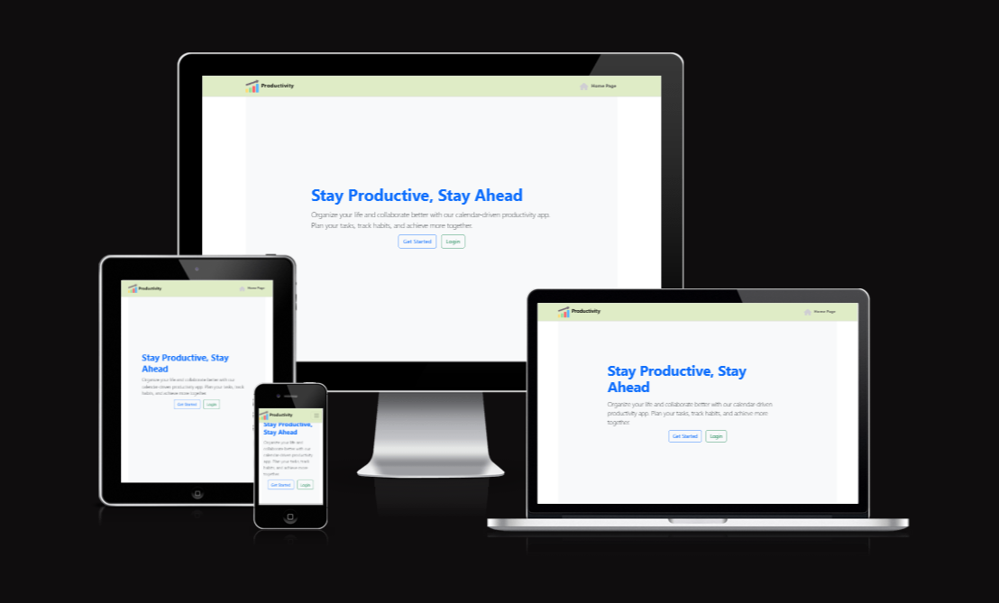

# 📅 Productivity App Project Backend



## Table of contents

* [Project goals](#project-goals)
* [Planning](#planning)
+ [Data models](#data-models)
  - [**Category**](#category)
  - [**Priority**](#priority)
  - [**TaskStatus**](#taskstatus)
  - [**Task**](#task)
  - [**UsrProfile**](#userprofile)
  - [**Settings**](#settings)
  - [**Attachment**](#attachment)
* [API endpoints](#api-endpoints)
* [Frameworks, libraries and dependencies](#frameworks--libraries-and-dependencies)
    + [django-cloudinary-storage](#django-cloudinary-storage)
    + [dj-allauth](#dj-allauth)
    + [dj-rest-auth](#dj-rest-auth)
    + [djangorestframework-simplejwt](#djangorestframework-simplejwt)
    + [dj-database-url](#dj-database-url)
    + [psychopg2](#psychopg2)
    + [python-dateutil](#python-dateutil)
    + [django-recurrence](#django-recurrence)
    + [django-filter](#django-filter)
    + [django-cors-headers](#django-cors-headers)
* [Testing](#testing)
    + [Manual testing](#manual-testing)
    + [Automated tests](#automated-tests)
    + [Python validation](#python-validation)
    + [Resolved bugs](#resolved-bugs)
      - [Bugs found while testing the API in isolation](#bugs-found-while-testing-the-api-in-isolation)
      - [Bugs found while testing the React front-end](#bugs-found-while-testing-the-react-front-end)
    + [Unresolved bugs](#unresolved-bugs)
* [Deployment](#deployment)
* [Credits](#credits)
---
## Project Goals
This project provides a Django Rest Framework API for the [Productivity App Project](https://github.com/yohannes2025/pp5_productivity_app_frontend).

The **Productivity App** project focuses on developing a **calendar-driven application** designed to help users organize their time efficiently. This **browser-based platform** allows users to create and manage **tasks and habits** effectively.
This application is built to ensure a **seamless user experience** in maintaining daily productivity through a clean, intuitive interface and smart task organization tools.

## Planning
Planning started by creating epics and user stories for the frontend application, based on the project goals. The user stories were used to inform wireframes mapping out the intended functionality and 'flow' through the app. See the [repo for the frontend React app](https://github.com/yohannes2025/pp5_productivity_app_frontend) for more details.

The user stories requiring implementation to achieve a minimum viable product (MVP) were then mapped to API endpoints required to support the desired functionality.

## Data Models
### Category Model

* Represents a category for tasks.
* **Fields:**
    * `name`: `CharField(max_length=100)` - The name of the category (e.g., "Work", "Personal").
* **`__str__` method:** Returns the name of the category, making it human-readable in the Django admin and other contexts.

### Priority Model

* Represents the priority level of a task.
* **Fields:**
    * `name`: `CharField(max_length=50)` - The name of the priority level (e.g., "High", "Medium", "Low").
    * `level`: `IntegerField(help_text="Lower number = higher priority")` - An integer representing the priority level. A lower number indicates a higher priority.
* **`__str__` method:** Returns a string combining the priority name and its level (e.g., "High (1)").

### TaskStatus Model

* Represents the status of a task.
* **Fields:**
    * `name`: `CharField(max_length=50)` - The name of the task status (e.g., "Pending", "In Progress", "Completed").
* **`__str__` method:** Returns the name of the task status.

### Task Model

* Represents a single task in the application.
* **Fields:**
    * `title`: `CharField(max_length=200)` - The title of the task.
    * `description`: `TextField(blank=True, null=True)` - A more detailed description of the task. Allows for empty or null values.
    * `due_date`: `DateField()` - The date when the task is due.
    * `created_at`: `DateTimeField(auto_now_add=True)` - Automatically set to the current time when the task is created.
    * `updated_at`: `DateTimeField(auto_now=True)` - Automatically updated to the current time whenever the task is saved.
    * `category`: `ForeignKey(Category, on_delete=models.SET_NULL, null=True)` - A foreign key relationship to the `Category` model. If a category is deleted, the `category` field of associated tasks will be set to `NULL`. Allows for tasks without a category.
    * `priority`: `CharField(max_length=20, choices=[('low', 'Low'), ('medium', 'Medium'), ('high', 'High')])` - The priority of the task, chosen from predefined options.
    * `status`: `CharField(max_length=20, choices=[('pending', 'Pending'), ('in progress', 'In Progress'), ('completed', 'Completed')])` - The current status of the task, chosen from predefined options.
    * `assigned_users`: `ManyToManyField(User, related_name='assigned_tasks')` - A many-to-many relationship with the built-in `User` model. Allows multiple users to be assigned to a single task, and a user can be assigned to multiple tasks. The `related_name` allows accessing tasks assigned to a user via `user.assigned_tasks`.
    * `owner`: `ForeignKey(settings.AUTH_USER_MODEL, on_delete=models.CASCADE, null=True)` - A foreign key relationship to the user who created the task. Uses the `AUTH_USER_MODEL` setting for flexibility. If the owner user is deleted, all their tasks will be deleted (`on_delete=models.CASCADE`). Allows for tasks without an explicit owner (though this might need consideration based on application logic).
    * `file`: `FileField(upload_to='attachments/', blank=True, null=True)` - Allows uploading a file attachment to the task. Files will be stored in the `attachments/` directory within the media root. Allows for no file to be uploaded.
* **`__str__` method:** Returns the title of the task.

### UserProfile Model

* Represents additional profile information for users. Note that this is a separate model from the built-in `User` model.
* **Fields:**
    * `name`: `CharField(max_length=100)` - The name of the user profile.
    * `avatar`: `ImageField(upload_to='avatars/', null=True, blank=True)` - Allows uploading an avatar image for the user. Images will be stored in the `avatars/` directory within the media root. Allows for no avatar to be uploaded.
* **`__str__` method:** Returns the name associated with the user profile.

### Settings Model

* Represents user-specific settings.
* **Fields:**
    * `user`: `OneToOneField(User, on_delete=models.CASCADE, default=1)` - A one-to-one relationship with the built-in `User` model. Each user will have exactly one settings object. If the associated user is deleted, their settings will also be deleted. The `default=1` might need to be reviewed as it assumes a default user with ID 1 exists. It's generally better to handle initial settings creation differently (e.g., via signals).
    * `theme`: `CharField(max_length=50, default='light')` - The user's preferred theme. Defaults to 'light'.
    * `notifications_enabled`: `BooleanField(default=True)` - Indicates whether notifications are enabled for the user. Defaults to `True`.
* **`__str__` method:** Returns the username of the associated user.

# API Endpoints Table

| Endpoint                      | Method | Description                                                                 |
|-------------------------------|--------|-----------------------------------------------------------------------------|
| `/api/categories/`            | GET    | Retrieve a list of all categories.                                        |
| `/api/categories/`            | POST   | Create a new category (requires `name` in request body).                  |
| `/api/categories/<id>/`       | GET    | Retrieve a specific category by its ID.                                   |
| `/api/categories/<id>/`       | PUT/PATCH | Update an existing category (requires `name` in request body).            |
| `/api/categories/<id>/`       | DELETE | Delete a specific category.                                               |
| `/api/priorities/`            | GET    | Retrieve a list of all priority levels.                                   |
| `/api/priorities/`            | POST   | Create a new priority level (requires `name` and `level` in request body). |
| `/api/priorities/<id>/`       | GET    | Retrieve a specific priority level by its ID.                              |
| `/api/priorities/<id>/`       | PUT/PATCH | Update an existing priority level (requires `name` and `level` in body).   |
| `/api/priorities/<id>/`       | DELETE | Delete a specific priority level.                                         |
| `/api/taskstatuses/`          | GET    | Retrieve a list of all task statuses.                                     |
| `/api/taskstatuses/`          | POST   | Create a new task status (requires `name` in request body).               |
| `/api/taskstatuses/<id>/`     | GET    | Retrieve a specific task status by its ID.                                |
| `/api/taskstatuses/<id>/`     | PUT/PATCH | Update an existing task status (requires `name` in request body).          |
| `/api/taskstatuses/<id>/`     | DELETE | Delete a specific task status.                                            |
| `/api/tasks/`                 | GET    | Retrieve a list of all tasks (supports filtering and pagination).         |
| `/api/tasks/`                 | POST   | Create a new task (requires relevant fields in request body).            |
| `/api/tasks/<id>/`            | GET    | Retrieve a specific task by its ID.                                      |
| `/api/tasks/<id>/`            | PUT/PATCH | Update an existing task (requires fields to update in request body).      |
| `/api/tasks/<id>/`            | DELETE | Delete a specific task.                                                 |
| `/api/userprofiles/`          | GET    | Retrieve a list of all user profiles.                                   |
| `/api/userprofiles/`          | POST   | Create a new user profile (requires `name` and optionally `avatar`).      |
| `/api/userprofiles/<id>/`     | GET    | Retrieve a specific user profile by its ID.                              |
| `/api/userprofiles/<id>/`     | PUT/PATCH | Update an existing user profile (requires `name` and optionally `avatar`). |
| `/api/userprofiles/<id>/`     | DELETE | Delete a specific user profile.                                         |
| `/api/settings/`              | GET    | Retrieve settings for the currently authenticated user.                   |
| `/api/settings/`              | PUT/PATCH | Update settings for the currently authenticated user (requires fields).    |
| `/api/users/<user_id>/settings/` | GET    | Retrieve settings for a specific user (admin/specific user access).      |
| `/api/users/<user_id>/settings/` | PUT/PATCH | Update settings for a specific user (admin/specific user access).      |
| `/api/attachments/`           | GET    | Retrieve a list of all attachments.                                     |
| `/api/attachments/`           | POST   | Upload a new attachment (requires `file` in `multipart/form-data`).     |
| `/api/attachments/<id>/`      | GET    | Retrieve a specific attachment by its ID.                               |
| `/api/attachments/<id>/`      | DELETE | Delete a specific attachment.                                           |


## Frameworks, libraries and dependencies
The Productivity API is implemented in Python using [Django](https://www.djangoproject.com) and [Django Rest Framework](https://django-filter.readthedocs.io/en/stable/).

The following additional utilities, apps and modules were also used.

### django-cloudinary-storage
https://pypi.org/project/django-cloudinary-storage/

Enables cloudinary integration for storing user profile images in cloudinary.

### dj-allauth
https://django-allauth.readthedocs.io/en/latest/

Used for user authentication. this package enables registration and authentication using a range of social media accounts.

### dj-rest-auth
https://dj-rest-auth.readthedocs.io/en/latest/introduction.html

Provides REST API endpoints for login and logout. 

### djangorestframework-simplejwt
https://django-rest-framework-simplejwt.readthedocs.io/en/latest/

Provides JSON web token authentication.

### dj-database-url
https://pypi.org/project/dj-database-url/

Creates an environment variable to configure the connection to the database.

### psychopg2
https://pypi.org/project/psycopg2/

Database adapater to enable interaction between Python and the PostgreSQL database.

### python-dateutil
https://pypi.org/project/python-dateutil/

This module provides extensions to the standard Python datetime module. It is a pre-requisite for django-recurrence library.

### django-recurrence
https://django-recurrence.readthedocs.io/en/latest/

This utility enables functionality for working with recurring dates in Django. It provides a `ReccurenceField` field type for storing recurring datetimes in the database.

### django-filter
https://django-filter.readthedocs.io/en/stable/

django-filter is used to implement ISO datetime filtering functionality for the `events` GET endpoint. The client is able to request dates within a range using the `from_date` and `to_date` URL parameters. The API performs an additional check after filtering to 'catch' any repeat events within the requested range, where the original event stored in the database occurred beforehand.

### django-cors-headers
https://pypi.org/project/django-cors-headers/

This Django app adds Cross-Origin-Resource Sharing (CORS) headers to responses, to enable the API to respond to requests from origins other than its own host.
Productivity App is configured to allow requests from all origins, to facilitate future development of a native mobile app using this API.


## Deployment

#  Deploying a Django REST Framework Backend to Render.com

## Prerequisites

Before deploying, ensure:

* You have a working **Django REST Framework (DRF)** project.
* Your project is on **GitHub** or **GitLab**.
* You have a `requirements.txt` file.
* Your project uses a virtual environment.
* You’ve created a free account on [Render](https://render.com/).

---

## Step 1: Prepare Your Django Project for Deployment

### 1.1. Create `requirements.txt`

```bash
pip freeze > requirements.txt
```

### 1.2. Install Gunicorn

```bash
pip install gunicorn
```

Make sure `gunicorn` is added to your `requirements.txt`.

---

### 1.3. (Optional) Create a `render.yaml` for Infrastructure as Code

```yaml
services:
  - type: web
    name: drf-api
    env: python
    plan: free
    buildCommand: "pip install -r requirements.txt"
    startCommand: "gunicorn your_project_name.wsgi:application"
    envVars:
      - key: DJANGO_SETTINGS_MODULE
        value: your_project_name.settings
      - key: SECRET_KEY
        generateValue: true
      - key: DEBUG
        value: false
```

> Replace `your_project_name` with the name of your Django project directory.

---

### 1.4. Update `settings.py` for Production

#### Add Allowed Hosts:

```python
ALLOWED_HOSTS = ['your-service-name.onrender.com']
```

#### Add Static File Config:

```python
STATIC_URL = '/static/'
STATIC_ROOT = os.path.join(BASE_DIR, 'staticfiles')
```

---

### 1.5. Collect Static Files

```bash
python manage.py collectstatic
```

---

##  Step 2: Push Your Code to GitHub

```bash
git init
git add .
git commit -m "Initial commit"
git remote add origin https://github.com/yourusername/your-repo.git
git push -u origin main
```

---

##  Step 3: Deploy to Render

1. Go to [Render.com](https://render.com/) and log in.
2. Click **“New +” → “Web Service”**.
3. Connect your GitHub repository.
4. Fill out deployment settings:

| Field         | Value                                         |
| ------------- | --------------------------------------------- |
| Name          | drf-api (or any name)                         |
| Environment   | Python                                        |
| Build Command | `pip install -r requirements.txt`             |
| Start Command | `gunicorn your_project_name.wsgi:application` |

5. Add the following environment variables:

```
DJANGO_SETTINGS_MODULE = your_project_name.settings
SECRET_KEY = your-secret-key
DEBUG = false
```

---

##  Step 4: (Optional) Add a PostgreSQL Database on Render

1. Go to **“New +” → “PostgreSQL”** in Render.
2. Name it and choose a free plan.
3. Copy the **Internal Database URL**.
4. Update `settings.py`:

```python
import dj_database_url

DATABASES = {
    'default': dj_database_url.config(default=os.getenv('DATABASE_URL'))
}
```

Install `dj-database-url`:

```bash
pip install dj-database-url
```

---

##  Step 5: Apply Migrations and Collect Static Files on Render

Use the **Shell** in the Render dashboard:

```bash
python manage.py migrate
python manage.py collectstatic --noinput
```

---

## Step 6: Access Your Live API

Visit:

```
https://your-service-name.onrender.com/
```

Make sure your API routes (e.g. `/api/`) are configured in `urls.py`.

---

## ✅ Final Deployment Checklist

| Task                             | Status |
| -------------------------------- | ------ |
| Code pushed to GitHub            | ✅      |
| `gunicorn` installed             | ✅      |
| Static files configured          | ✅      |
| `DEBUG=False` in production      | ✅      |
| `SECRET_KEY` in environment vars | ✅      |
| PostgreSQL set up (optional)     | ✅      |
| Migrations applied               | ✅      |
| API tested live                  | ✅      |

---

##  References

* [Render.com Docs](https://render.com/docs)
* [Django Deployment Checklist](https://docs.djangoproject.com/en/stable/howto/deployment/checklist/)


## Testing

### Manual testing

### Automated tests

### Python validation

## Credits

### Resolved bugs

#### Bugs found while testing the API in isolation

#### Bugs found while testing the React front-end
### Unresolved bugs


## Credits
### Acknowledgments

- Thank you very much Code Institute Student Care Team Tutor and Mentor for your dedication and commitment in supporting me to achieve in submitting this Advanced Front-End Full Stack Software Development project and broadening my career opportunities.
